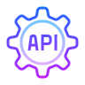

<h3 align="center"> Hi there 👋</h3>

I'm Vadym, a self-motivated tech enthusiast and Backend Developer.

### My stack and tools :

<table align="center">
  <tr>
     <td align="center"  width="88">
         
       Java
    </td>
    <td align="center" width="88">
        
       Spring
    </td>
<td align="center" width="88">
         
       Keycloak
    </td>
    <td align="center" width="88">
        
       AWS
    </td>
    <td align="center" width="88">
        
       Kafka
    </td>
    <td align="center" width="88">
        
       Docker
    </td>
    <td align="center" width="88">
        
       MySql
    </td>
    <td align="center" width="88">
      
       Postgres
    </td>
        <td align="center" width="88">
       
       Elasticsearch
      </td>
  </tr>
    <td align="center" width="88">
        
       Swagger
    </td>
    <td align="center" width="88"> 
        
       Idea
    </td>
    <td align="center"  width="88">
        
       Rest API
    </td>
    <td align="center" width="88">
        
       Project Reactor
    </td>
      <td align="center" width="88">
    
       Postman
    </td>
      </td>
      <td align="center" width="88">
        
       MongoDB
     </td>
     <td align="center" width="88">
        
       Git
    </td>
  <td align="center" width="88">
        
       Redis
     </td>
  <td align="center" width="88">
        
       Grafana
     </td>
</table>

### Languages :

<table  align="center">
  <tr>
    
        🇺🇦 Ukrainian - Native
        
  </tr>

  <tr>
    
        🇬🇧 English - B2+
        
  </tr>

  <tr>
    
        🇺🇦 Czech - A2
        
  </tr>

  <tr>
    
        🇺🇦 Russian - Native
        
  </tr>
</table>

 
 

